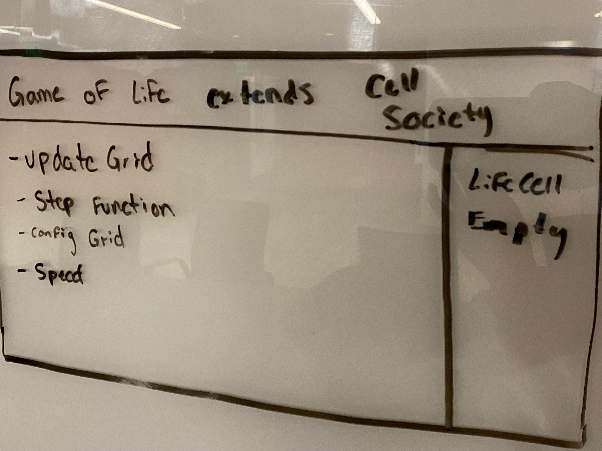

# Cell Society Design Plan
### Team Number: 03
### Names: Cynthia France, Diane Kim, Jose Santillan


## Introduction
In this project, we want to create a user interface that allows the user to choose to run one of 5
cell simulations. The UI will consist of buttons and toggles that allows the user to select the 
simulation & any parameters. The primary design goal is to make it so that any future programmer
can make their own cell simulation and add it to our interface without any issues. The program 
will be able to take in an XML file specifying the simulation and starting configuration and run 
to its completion. Adding new projects/simulations/cell types should be open (just adding a new 
subclass). The code to check neighbors, characteristics of cells and their interactions with 
neighbors should be closed from modification. 

## Design Overview





## Design Details

* ```Simulation``` (Model): This is essentially the Model component of our project (out of MVC). The superclass
    keeps track of a variety of variables essential to the simulations, ie author, grid size, description,
    and other parameters. It would also contain many abstract methods such as ```updateGrid()``` and ```step()``` that
    take care of overall simulation calculations
    * ```GameOfLife```
    * ```Fire```
    * ```Schelling```
    * ```WaTor```
    * ```Percolation```
* ```Cell``` (Model): This is a helper class essential for the functioning of Simulation. Cells keep track
    of their own state and are in charge of their own actions. General member variables keep track of
    the state of the cell and its next states, while subclasses will have additional variables such 
    as lives (for fish) and happiness (for Schelling's).
    * ```LifeCell``` (for game of life)
    * ```Empty``` (for all)
    * ```Burning``` (for fire)
    * ```Tree``` (for fire)
    * ```GroupA``` (sh)
    * ```GroupB```
    * ```Fish```
    * ```Shark```
    * ```Filled```
    * ```Active```
    * ```NotOpen```
* ```GUI``` (View): This is essentially the view of our project, and dictates what the user sees and
    interacts with. Some important functions include: updating grid, calling the controller to 
    update state/get information, recognizing when certain buttons are pressed, and generally 
    communicating to the back-end the user's desires.
    * ```GameOfLifeGUI```
    * ```FireGUI```
    * ```SchellingGUI```
    * ```WaTorGUI```
    * ```PercolationGUI```
* ```Controller```: This class is responsible for communicating between the model and the view. The 
  controller is aware of the needs of both classes and updates/asks the other class for information
  each time something is requested or an event occurs. For example, if the playButton is pressed, the
  controller knows to ask the model for the next generation of cells. Once this is obtained, the controller
  will pass the information to the view so that it can update itself.


## Use Cases

 * Team generated Use Case
 ```java
 Something thing = new Something();
 Order o = thing.makeOrder("coffee,large,black");
 o.update(13);
 ```
* Apply the rules to a middle cell: set the next state of a cell to dead by counting its number of neighbors using the Game of Life rules for a cell in the middle (i.e., with all its neighbors)
``` if a middle cell is currently being index```
if (cell.getNeighbors() > 3 || cell.getNeighbors() <= 1) {
    cell.setDead();
}

  * Apply the rules to an edge cell: set the next state of a cell to live by counting its number of neighbors using the Game of Life rules for a cell on the edge (i.e., with some of its neighbors missing)
  if (cell.isEdge()) {
    if (cell.getNeighbors() > 3 || cell.getNeighbors() <= 1) {
    cell.setDead();
    }
    
}

* Move to the next generation: update all cells in a simulation from their current state to their next state and display the result graphically
private void updateGrid(){
    for (int i = 0; i < grid.size(); i++) {
        for (int j = 0; j < grid.get(i).size();j++) {
            grid.get(i).get(j).update();
    }
}


* Switch simulations: load a new simulation from a data file, replacing the current running simulation with the newly loaded one
````if a user presses a numkey to switch to a different simulation````
```java
    switch (keyCode) {
      case DIGIT1 -> CellSociety.switchScene(1);
      case DIGIT2 -> CellSociety.switchScene(2);
      case DIGIT3 -> ...
    }
```
``` in the cell society class```
public static void switchScene()


* Set a simulation parameter: set the value of a parameter, probCatch, for a simulation, Fire, based on the value given in a data file
```public Fire fire = new Fire(gridX, gridY, probCatch, ...);```
OR
```fire.setProbCatch(proCatch);```

* Save the current generation as a new configuration file:
```java
    String newAuthor = authorTextField.text();
    String newDescription = descTextField.text();
    String newTitle = titleTextField.text();
    CellSociety.saveAsNewConfig(newTitle, newAuthor, newDescription, Simulation.getGrid());
```


## Design Considerations

#### Design Issue #1
One design issue that we are currently facing is how to implement the random movement of fish without 2 fish colliding in the same square.
The reason that this issue arises is because of the simultaneous nature of the program to move the entire group in one turn.

 * Alternative #1
   One alternative is to have the first fish move freely within its available squares and every fish after moving in accordance to the previous fish.
 * Alternative #2
    A second solution is to have the simulation run as normal but if any collisions occur, the simulation must form a new generation
   using the previous generation (the one before the collision).
 * Trade-offs
    The trade-off of the first alternative is the fact that the movement is no longer random, thus eliminating a huge part of the simulation.`
    The trade-off of the second game is the enormous runtime that this could potentially cause, even slowing down the simulation to a pause 
    if it is impossible for the fish to move without colliding.

#### Design Issue #2
Another design issue somewhat similar to the above is how to coordinate cell moves for the Schelling
model. If the grid contains more cells/individuals that are unhappy/need to be moved than open spaces,
and since all the moves must happen at the same time, we run into the problem of not finding an
open space for all the cells that must move.

 * Alternative #1
    In addition to "empty" and "filled" cells, have an in-between state where cells that contain
    unhappy individuals are also considered in the list of cells that are empty (and thus can hold
   a different individual). This way, there will never be a shortage of cells to move to
 * Alternative #2
    Continue to move cells that could not move before into new spots as they are vacated by individuals
    that could move. This would all happen in one "turn" and the view would not update until all
    unhappy individuals have had the chance to move.
 * Trade-offs
    The first alternative would involve yet another data structure/object/variable to keep track of,
   but it would be significantly easier to move all the individuals (one round is more than sufficient).
   The second alternative wouldn't require any additional pieces, but would be much harder to implement,
    as we would need to re-loop through everything until all unhappy cells have been relocated.


## User Interface

Here is our amazing UI:


Ways the user can interact with the UI:
* click the dropdown menu with simulation title to choose another configuration file to load
* click the pause/play buttons
* click speed up/slow down buttons
* save the current state into another configuration file
    * User will be prompted for information about the configuration file to enter in
* click the "i" in the corner to read the current simulation's about info

Situations that prompt errors:
* "Missing inputs": the user did not enter in information for one or more fields when saving
  a file
* "Bad input data": the configuration file to be uploaded is not formatted correctly
* "Empty data": the configuration file cannot be found


## Team Responsibilities

 * Cynthia: 
   * Primary: Percolation, Schelling's
   * Secondary: GUI + XML + design + refactoring + documentation

 * Diane: 
   * Primary: Spreading of Fire, CSS
   * Secondary: GUI + XML + design + refactoring + documentation

 * Jose: 
   * Primary: Wa-Tor, XML
   * Secondary: GUI + design + refactoring + documentation


#### Proposed Schedule
1. Work together to implement interface basics + first simulation (game of life) (complete by 1/27)
2. Split up each design a different simulation model (complete by 1/30)
3. Come back together to refactor + document (complete by 2/6)